<!-- README.md is generated from README.Rmd. Please edit that file -->

# mestrado-renata-ml

``` r
library(tidyverse)
files_eu <- list.files("data/EU espacial/",full.names = TRUE)
files_sp <- list.files("data/SP espacial/",full.names = TRUE)
files_eu[1]
#> [1] "data/EU espacial/Al_EU.grd"
```

``` r
grd_read <- function(arq){
  nome <- str_split(arq, "/", simplify = TRUE)[3] %>%  str_remove(".grd")
  dados <- read.table(arq, skip = 5) %>% as.tibble()
  vetor <- as.vector(as.matrix(dados))
  data.frame(nome,vetor)
}
eu <- map_df(files_eu,grd_read)
eu$nome %>% unique() %>% sort()
#>  [1] "Al_EU"     "Ca_EU"     "Ds_EU"     "EstC_EU"   "F03062017" "F10062017"
#>  [7] "F15032017" "F17022017" "F17062017" "H-Al_EU"   "HLIFS_EU"  "K_EU"     
#> [13] "Macro_EU"  "Mg_EU"     "Micro_EU"  "P_EU"      "pH_EU"     "SB_EU"    
#> [19] "T03062017" "T10062017" "T15032017" "T17022017" "T17062017" "U03062017"
#> [25] "U10062017" "U15032017" "U17022017" "U17062017"
```

``` r
sp <- map_df(files_sp,grd_read)
sp$nome %>% unique() %>% sort()
#>  [1] "Al_SP"     "Ca_SP"     "Ds_SP"     "EstC_SP"   "F03022017" "F03032017"
#>  [7] "F03062017" "F08032017" "F09022017" "F10062017" "F17032017" "F17062017"
#> [13] "F22022017" "H_Al_SP"   "HLIFS_SP"  "K_SP"      "Macro_SP"  "Mg_SP"    
#> [19] "Micro_SP"  "P_SP"      "pH_SP"     "SB_SP"     "T03022017" "T03032017"
#> [25] "T03062017" "T08032017" "T09022017" "T10062017" "T17032017" "T17062017"
#> [31] "T22022017" "U03022017" "U03032017" "U03062017" "U08032017" "U09022017"
#> [37] "U10062017" "U17032017" "U17062017" "U22022017"
```

## Mapas Eucalipto

``` r
for(i in seq(files_eu)){
  mp<-read.table(files_eu[i],skip = 5)
  image(mp %>%  as.matrix(),xlab = files_eu[i])
}
```

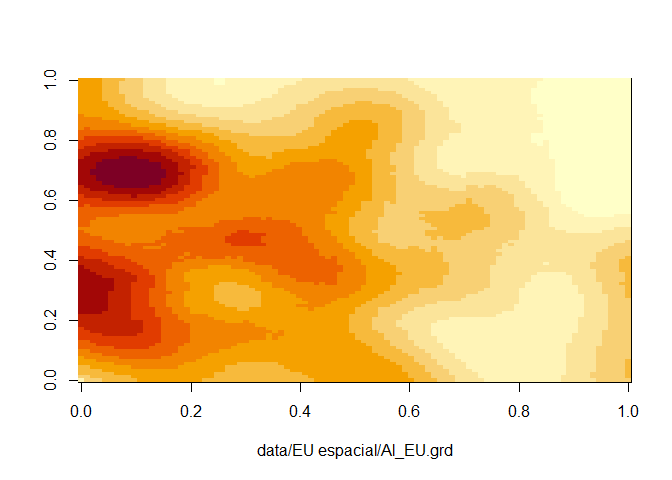<!-- -->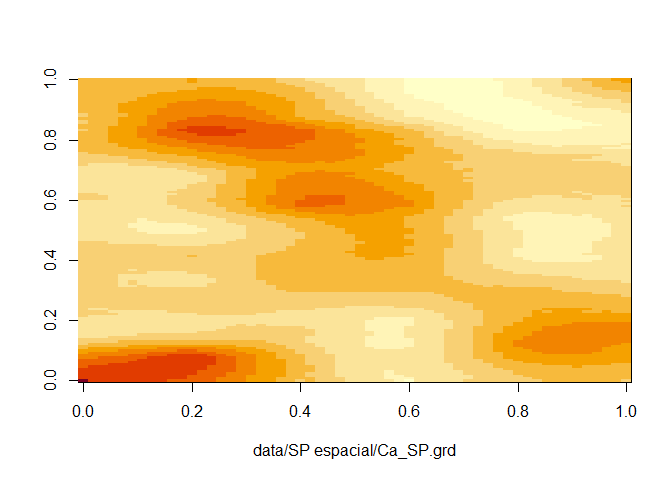<!-- -->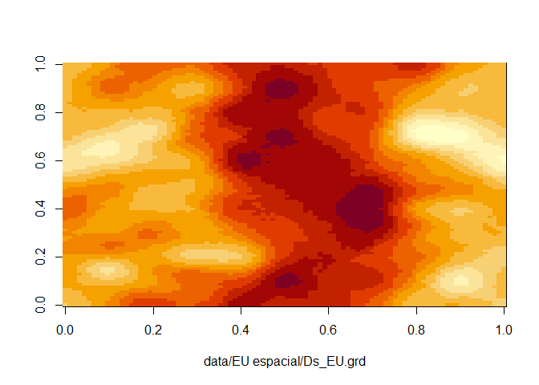<!-- -->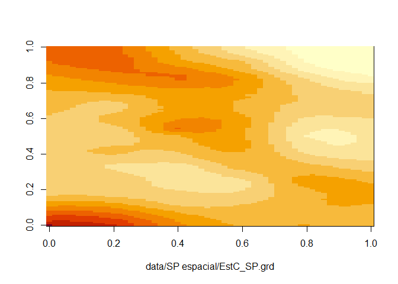<!-- --><!-- -->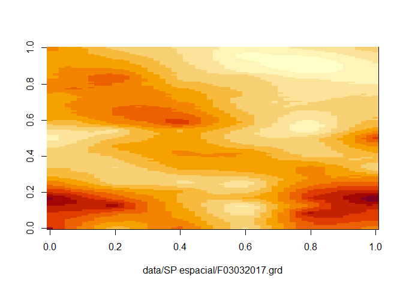<!-- -->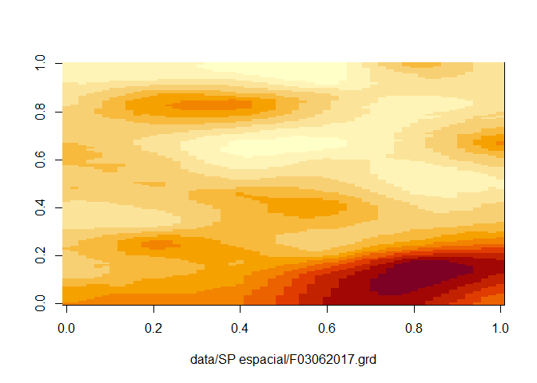<!-- -->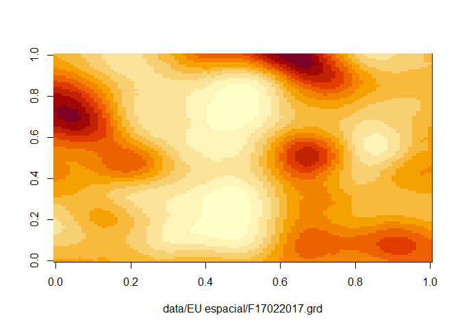<!-- -->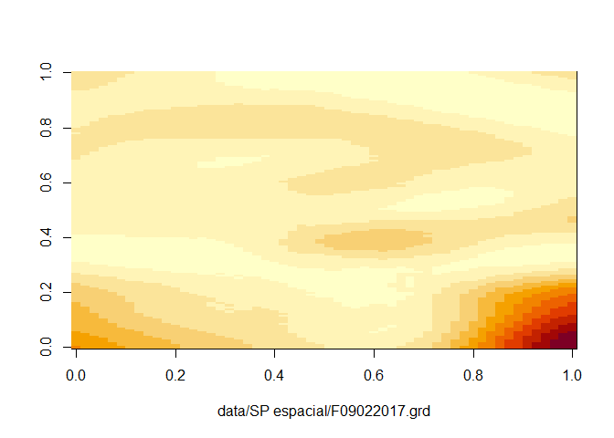<!-- -->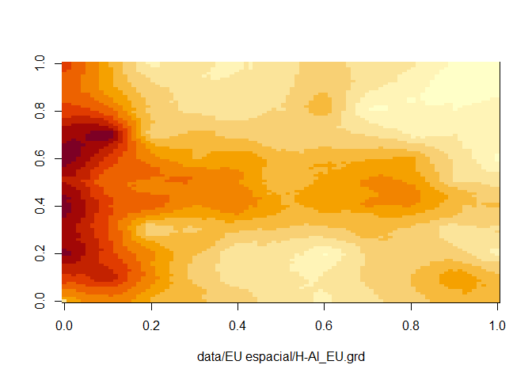<!-- -->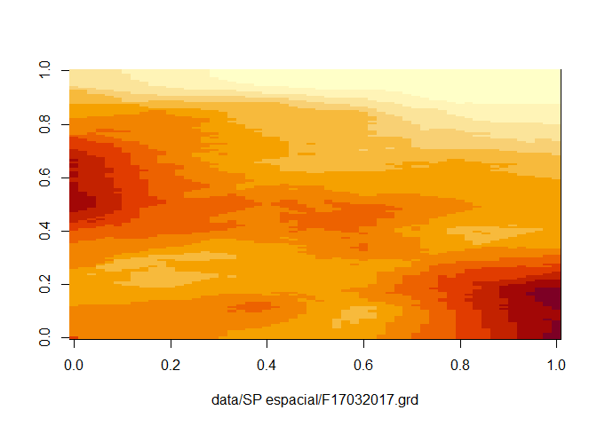<!-- -->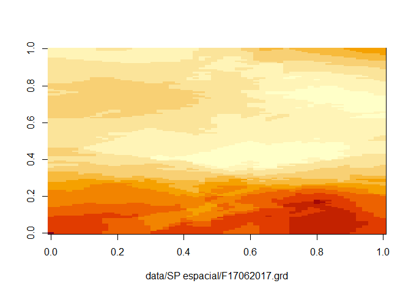<!-- --><!-- --><!-- -->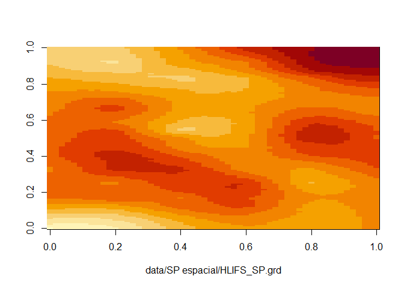<!-- --><!-- -->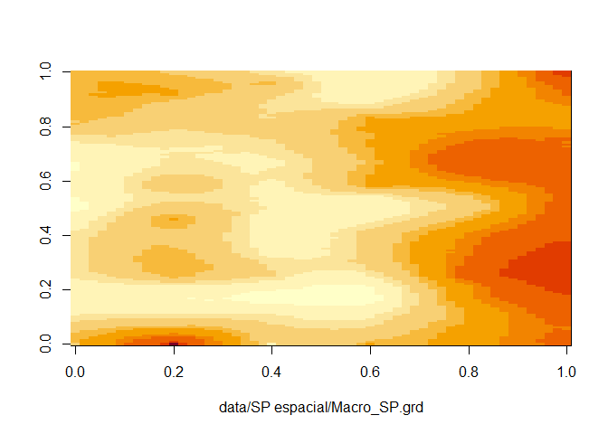<!-- -->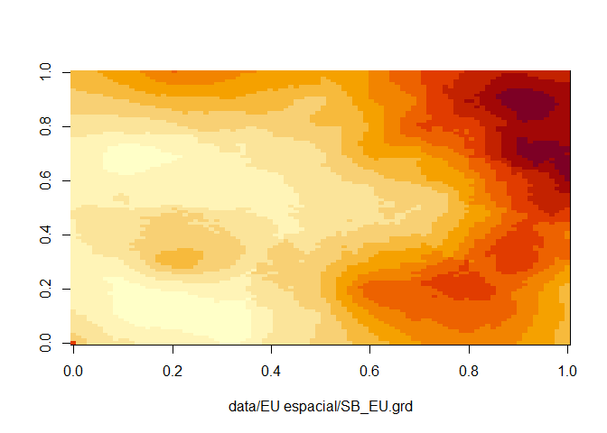<!-- --><!-- --><!-- -->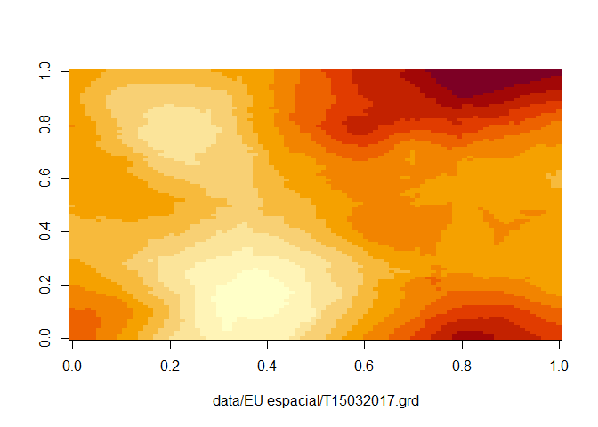<!-- -->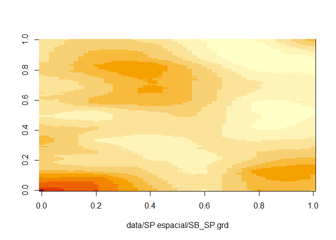<!-- -->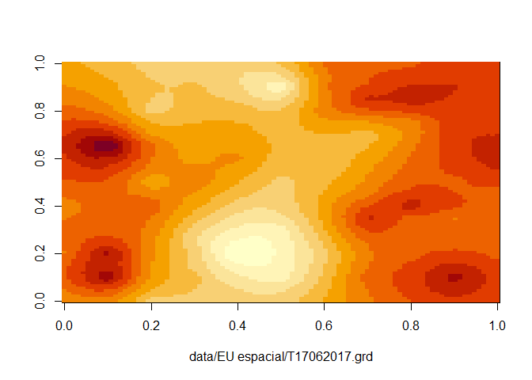<!-- --><!-- --><!-- -->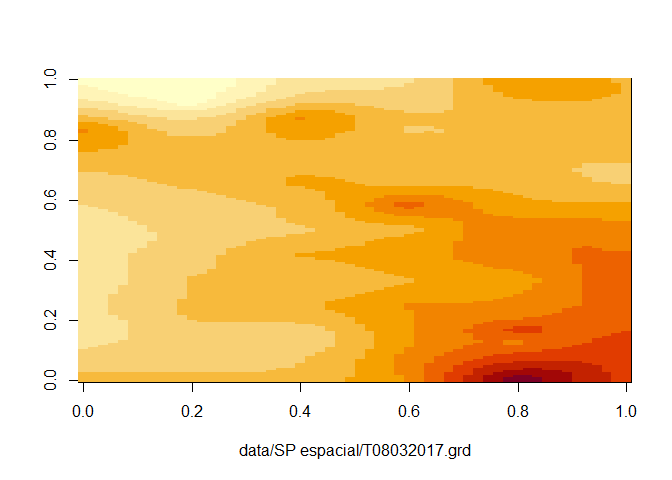<!-- --><!-- -->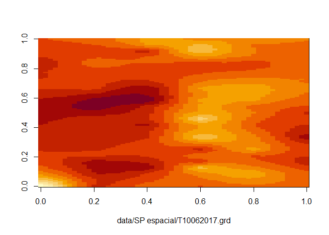<!-- -->

## Mapas Silvipastoril

``` r
for(i in seq(files_sp)){
  mp<-read.table(files_sp[i],skip = 5)
  image(mp %>%  as.matrix(),xlab = files_sp[i])
}
```

<!-- --><!-- --><!-- --><!-- --><!-- --><!-- --><!-- --><!-- --><!-- --><!-- --><!-- --><!-- --><!-- --><!-- --><!-- --><!-- --><!-- --><!-- --><!-- --><!-- --><!-- --><!-- --><!-- --><!-- --><!-- --><!-- --><!-- --><!-- --><!-- --><!-- --><!-- --><!-- --><!-- --><!-- --><!-- --><!-- --><!-- --><!-- --><!-- --><!-- -->
