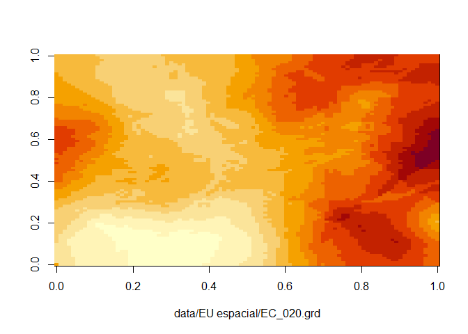
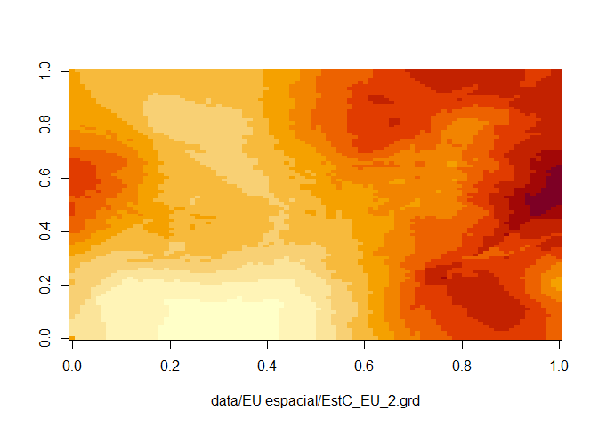
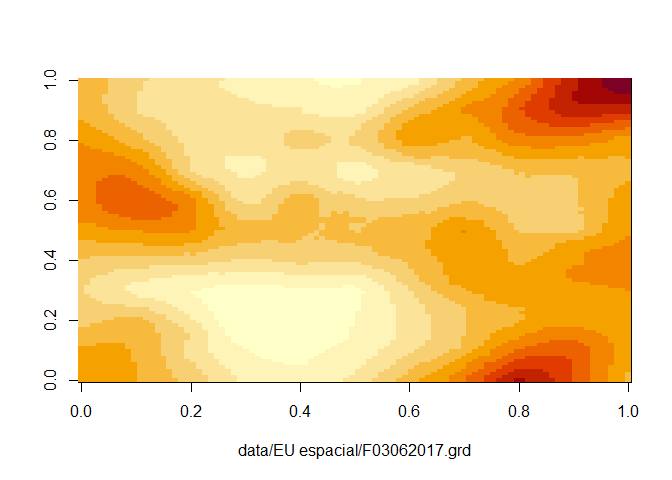
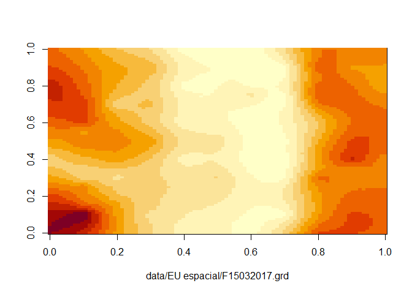
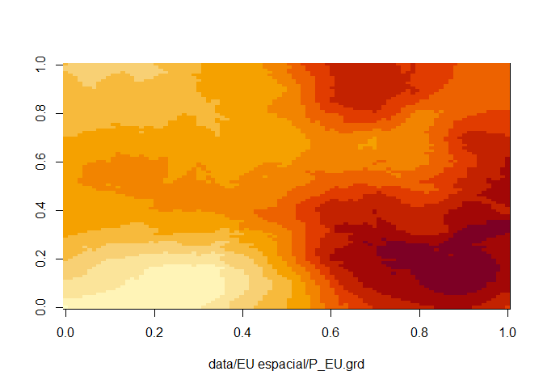

<!-- README.md is generated from README.Rmd. Please edit that file -->

# mestrado-renata-ml

``` r
library(tidyverse)
files_eu <- list.files("data/EU espacial/",full.names = TRUE)
files_sp <- list.files("data/SP espacial/",full.names = TRUE)
files_eu[1]
#> [1] "data/EU espacial/Al_EU.grd"
```

## Mapas Eucalipto

``` r
for(i in seq(files_eu)){
  mp<-read.table(files_eu[i],skip = 5)
  image(mp %>%  as.matrix(),xlab = files_eu[i])
}
```

<!-- --><!-- --><!-- --><!-- --><!-- --><!-- --><!-- --><!-- --><!-- --><!-- --><!-- --><!-- --><!-- --><!-- --><!-- --><!-- --><!-- --><!-- --><!-- --><!-- --><!-- --><!-- --><!-- --><!-- --><!-- --><!-- --><!-- --><!-- --><!-- --><!-- -->

## Mapas Silvipastoril

``` r
# for(i in seq(files_sp)){
#   mp<-read.table(files_sp[i],skip = 5)
#   image(mp %>%  as.matrix(),xlab = files_sp[i])
# }
```
