# mestrado-renata-ml

### Carregando os pacotes exigidos

``` r
library(readxl)
library(tidyverse)
library(geobr)
library(skimr)
library(tidymodels)
library(ISLR)
library(modeldata)
library(vip)
library(ggpubr)
source("R/my_functions.R")
```

### Listando os arquivos com os mapas de cada área separadamente

``` r
files_eu <- list.files("data/EU espacial/",full.names = TRUE)
files_sp <- list.files("data/SP espacial/",full.names = TRUE)
```

### Carregando os mapa para Eucalipto

``` r
eu <- map_df(files_eu,grd_read)
```

### Arquivo com os dados de emissão, temperatura e umidade (temporal)

``` r
temporal_eu <- eu %>% 
  filter(str_detect(nome,"^[F|U|T]")) %>% 
  mutate(numero = as.numeric(str_remove(nome,"F|T|U")),
         ano = numero %% 10000,
         mes = numero %% 1000000 %/% 10000,
         dia = numero %/% 1e6,
         nome = str_remove_all(nome,"[0-9]")) %>% 
  pivot_wider(names_from = nome, 
              values_from = vetor)
```

### Arquivo com os dados dos atributos do solo, somente geoespacializados

``` r
spatial_eu <- eu %>% 
  filter(!str_detect(nome,"^[F|U|T]")) %>% 
  mutate(nome = str_remove(nome,"_EU")) %>% 
  pivot_wider(names_from = nome, 
              values_from = vetor)
```

### Unindo as bases de dados, ou seja, repetindo os dados do solo para cada dia de avaliação

``` r
data_eu <- left_join(temporal_eu, spatial_eu, by="id") %>% 
  select(-numero) %>% 
  mutate(data = make_date(year= ano, month=mes, day=dia)) %>% 
  relocate(id,data)
```

### Carregando os mapa para Sistema Silvipastoril

``` r
sp <- map_df(files_sp,grd_read)
```

### Arquivo com os dados de emissão, temperatura e umidade (temporal)

``` r
temporal_sp <- sp %>% 
  filter(str_detect(nome,"^[F|U|T]")) %>% 
  mutate(numero = as.numeric(str_remove(nome,"F|T|U")),
         ano = numero %% 10000,
         mes = numero %% 1000000 %/% 10000,
         dia = numero %/% 1e6,
         nome = str_remove_all(nome,"[0-9]")) %>% 
  pivot_wider(names_from = nome, 
              values_from = vetor)
```

### Arquivo com os dados dos atributos do solo, somente geoespacializados

``` r
spatial_sp <- sp %>% 
  filter(!str_detect(nome,"^[F|U|T]")) %>% 
  mutate(nome = str_remove(nome,"_SP")) %>% 
  pivot_wider(names_from = nome, 
              values_from = vetor)
```

### Unindo as bases de dados, ou seja, repetindo os dados do solo para cada dia de avaliação

``` r
data_sp <- left_join(temporal_sp, spatial_sp, by="id") %>% 
  select(-numero) %>% 
  mutate(data = make_date(year= ano, month=mes, day=dia)) %>% 
  relocate(id,data)
```

``` r
tibble(xnames=names(data_eu), ynames=names(data_sp)) %>% 
  mutate(logic_test = xnames == ynames)
#> # A tibble: 21 × 3
#>    xnames ynames logic_test
#>    <chr>  <chr>  <lgl>     
#>  1 id     id     TRUE      
#>  2 data   data   TRUE      
#>  3 ano    ano    TRUE      
#>  4 mes    mes    TRUE      
#>  5 dia    dia    TRUE      
#>  6 F      F      TRUE      
#>  7 T      T      TRUE      
#>  8 U      U      TRUE      
#>  9 Al     Al     TRUE      
#> 10 Ca     Ca     TRUE      
#> # ℹ 11 more rows
```

### Unindo toda a base de dados

``` r
data_set <- rbind(data_eu %>% 
                    mutate(local="EU"),
                  data_sp %>% 
                    mutate(local="SP")) %>% 
  relocate(local)
```

## Aprendizado de Máquina

``` r
# Definindo a base de treino e a base de teste
locais <- data_set %>% pull(local) %>% unique()

for(i in seq_along(locais)){
  lo <- locais[i]
  data <- data_set %>% filter(local == lo)
  dias <- data$data %>% unique()
  for(j in seq_along(dias)){
    di <- dias[j]
    df <- data %>% filter(data == di)
    fco2_initial_split <- initial_split(df  %>%                                          select(-c(id,ano,mes,dia,local)) %>%                                           sample_n(trunc(nrow(df)*.75)), prop = 0.75)
    fco2_train <- training(fco2_initial_split)

    hist_fco2 <- fco2_train  %>%
      ggplot(aes(x=F, y=..density..))+
      geom_histogram(bins = 30, color="black",  fill="lightgray")+
      geom_density(alpha=.05,fill="red")+
      theme_bw() +
      labs(x="FCO2", y = "Densidade",title = paste(lo,di))
    print(hist_fco2)

    fco2_train   %>%    
      select(where(is.numeric)) %>%
      drop_na() %>%
      cor()  %>%
      corrplot::corrplot()

    fco2_recipe <- recipe(F ~ ., data = fco2_train) %>%
      step_novel(all_nominal_predictors()) %>%
      step_zv(all_predictors()) %>%
      step_dummy(all_nominal_predictors())
    bake(prep(fco2_recipe), new_data = NULL)
    # visdat::vis_miss(bake(prep(fco2_recipe), new_data = NULL))

    fco2_resamples <- vfold_cv(fco2_train, v = 10) #<-------
    grid <- grid_regular(
      penalty(range = c(-8, 0)),
      levels = 20 #<-------
    )

    fco2_rf_model <- rand_forest(
      min_n = tune(),
      mtry = tune(),
      trees = tune()
    )   %>%
      set_mode("regression")  %>%
      set_engine("randomForest")

    fco2_rf_wf <- workflow()   %>%
      add_model(fco2_rf_model) %>%
      add_recipe(fco2_recipe)

    grid_rf <- grid_random(
      min_n(range = c(20, 30)),
      mtry(range = c(5, 20)),
      trees(range = c(100, 300) ),
      size = 20
    )
    fco2_rf_tune_grid <- tune_grid(
      fco2_rf_wf,
      resamples = fco2_resamples,
      grid = grid_rf,
      metrics = metric_set(rmse)
    )
    print(autoplot(fco2_rf_tune_grid))

    fco2_rf_best_params <- select_best(fco2_rf_tune_grid, "rmse")
    fco2_rf_wf <- fco2_rf_wf %>% finalize_workflow(fco2_rf_best_params)
    fco2_rf_last_fit <- last_fit(fco2_rf_wf, fco2_initial_split)

    fco2_test_preds <- bind_rows(
      collect_predictions(fco2_rf_last_fit)  %>%   mutate(modelo = "rf")
    )
    pre_obs_plot <- fco2_test_preds %>%
      ggplot(aes(x=.pred, y=F)) +
      geom_point()+
      theme_bw() +
      geom_smooth(method = "lm") +
      stat_regline_equation(ggplot2::aes(
        label =  paste(..eq.label.., ..rr.label.., sep = "*plain(\",\")~~")))+
      labs(title = paste(lo,di))
    print(pre_obs_plot)
    
    fco2_modelo_final <- fco2_rf_wf %>% fit(df)
    saveRDS(fco2_modelo_final, 
            paste0("models/fco2_modelo_",lo,"_",di,".rds"))

    fco2_rf_last_fit_model <- fco2_rf_last_fit$.workflow[[1]]$fit$fit
    vip_plot <- vip(fco2_rf_last_fit_model,
        aesthetics = list(color = "grey35", size = 0.8, fill="orange")) +
      theme_bw()
    print(vip_plot)
  }
}
```

<!-- --><!-- -->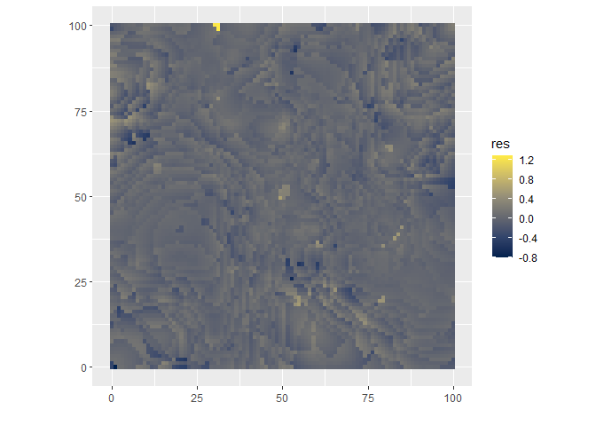<!-- --><!-- --><!-- -->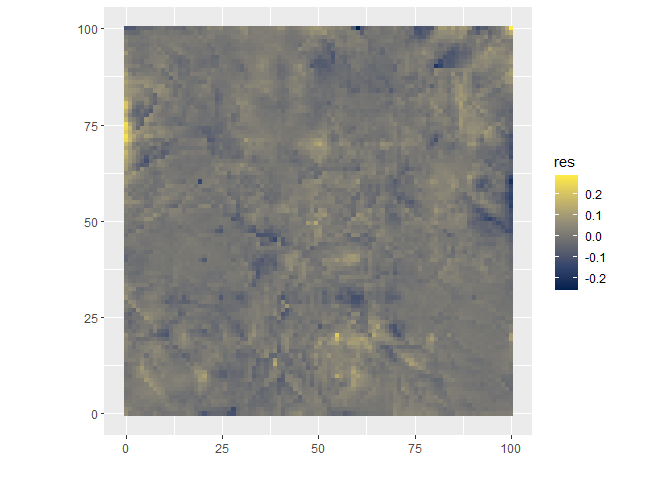<!-- -->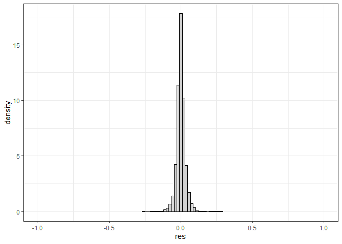<!-- --><!-- --><!-- --><!-- --><!-- --><!-- --><!-- --><!-- --><!-- -->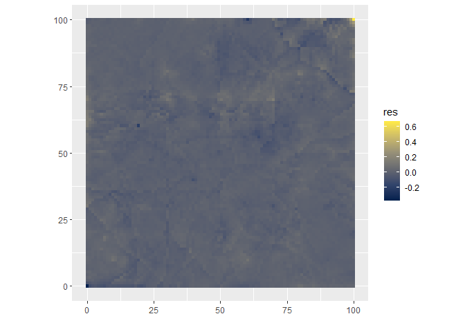<!-- -->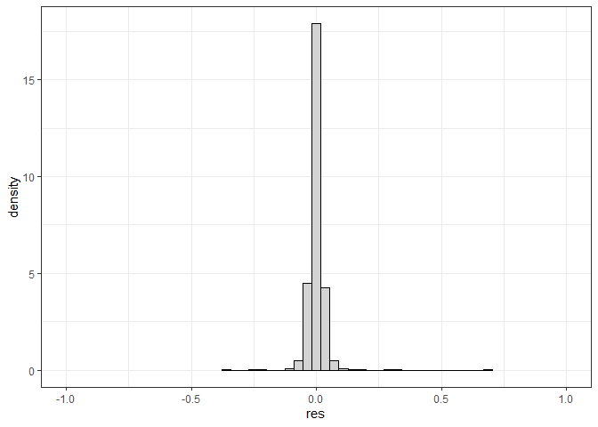<!-- --><!-- --><!-- --><!-- -->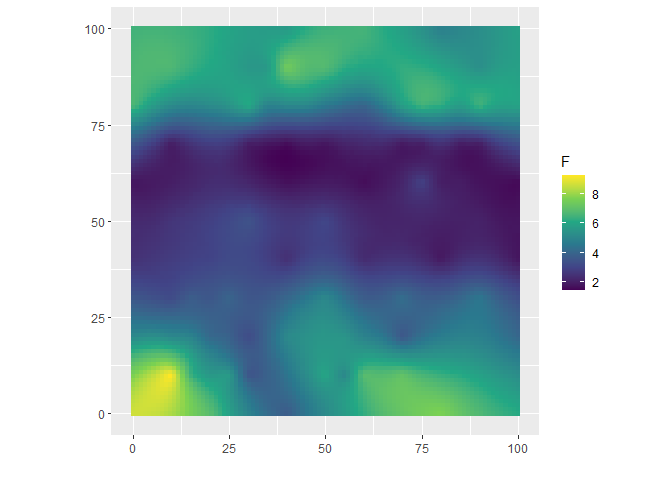<!-- --><!-- -->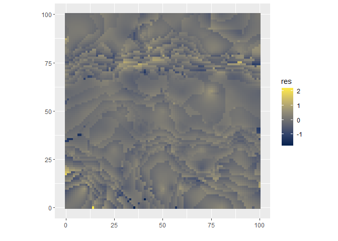<!-- --><!-- --><!-- -->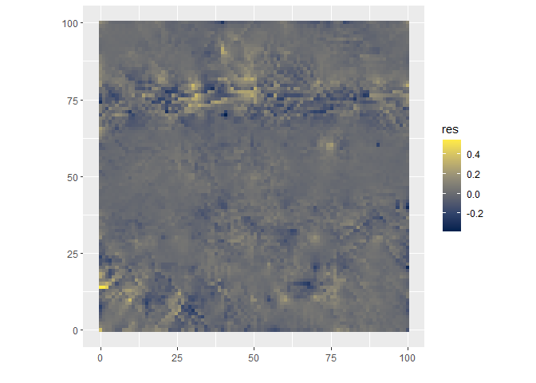<!-- -->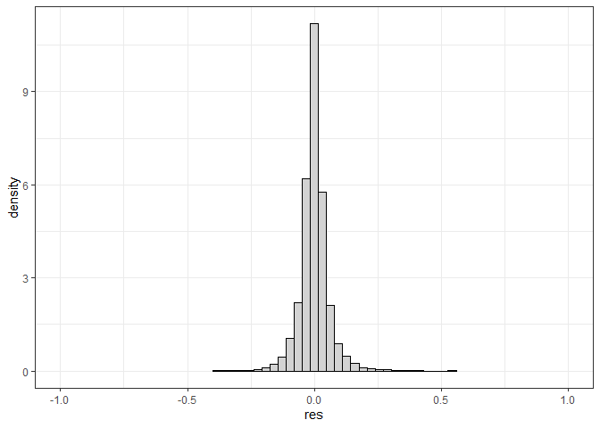<!-- --><!-- --><!-- --><!-- -->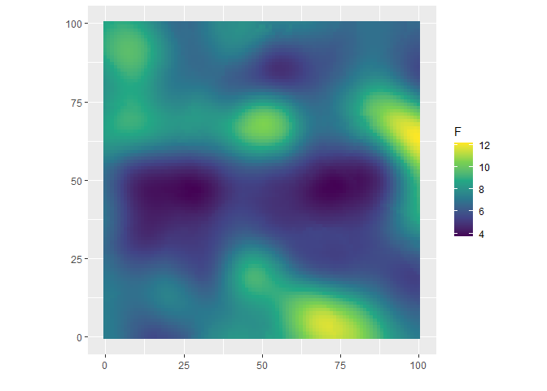<!-- --><!-- --><!-- -->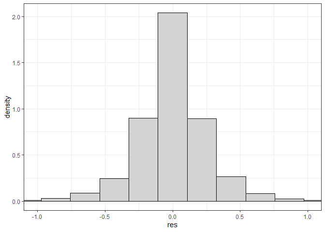<!-- --><!-- --><!-- -->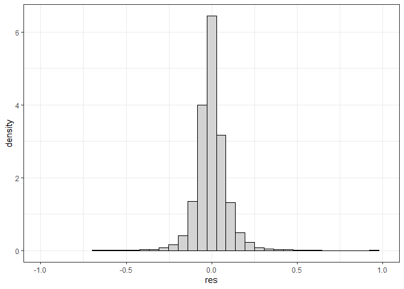<!-- --><!-- --><!-- -->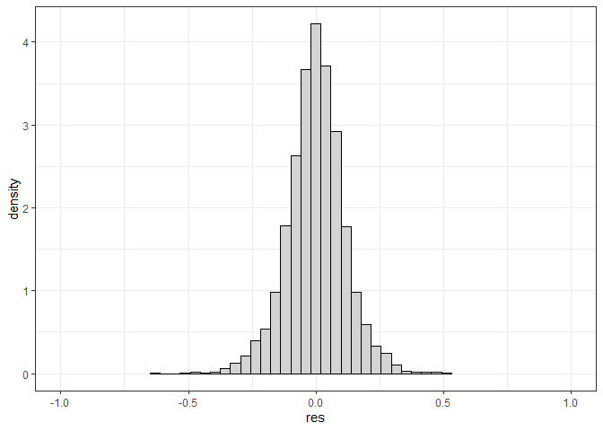<!-- --><!-- --><!-- -->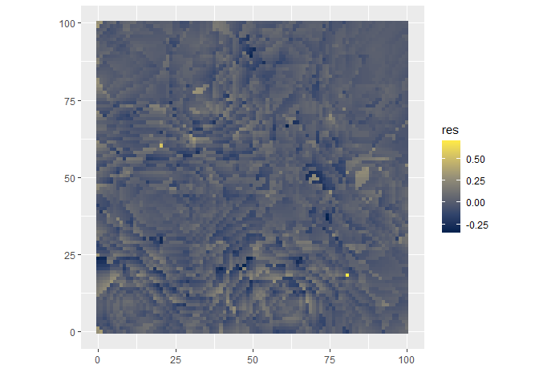<!-- -->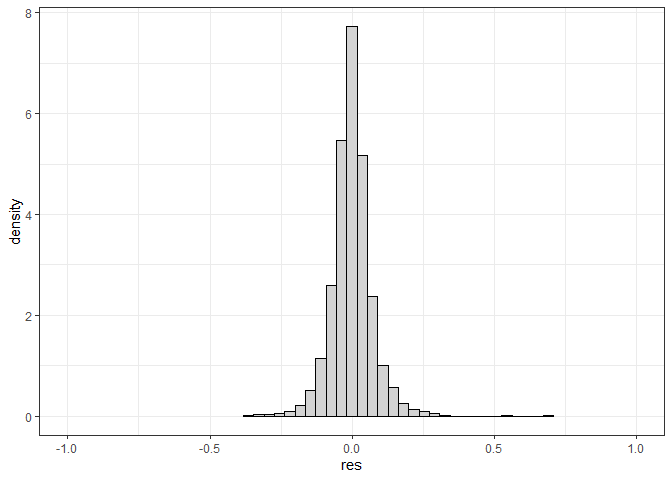<!-- --><!-- -->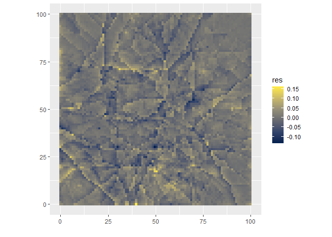<!-- --><!-- --><!-- --><!-- --><!-- --><!-- -->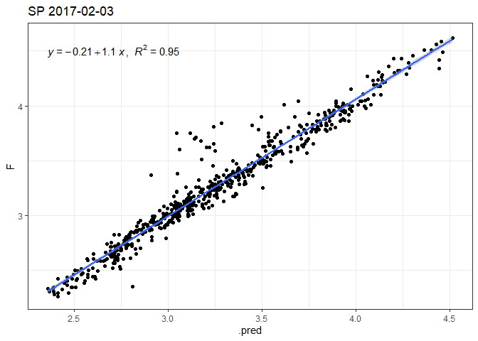<!-- --><!-- --><!-- -->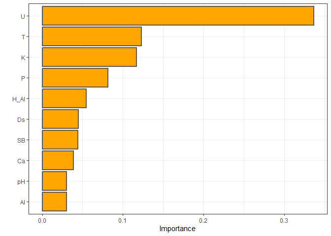<!-- --><!-- --><!-- -->

# Material de Apêndice - Sinais (mapas dos atributso geoespacializados)

## Mapas Eucalipto

``` r
for(i in seq(files_eu)){
  mp<-read.table(files_eu[i],skip = 5)
  image(mp %>%  as.matrix(),xlab = files_eu[i])
}
```

<!-- --><!-- --><!-- --><!-- --><!-- --><!-- --><!-- -->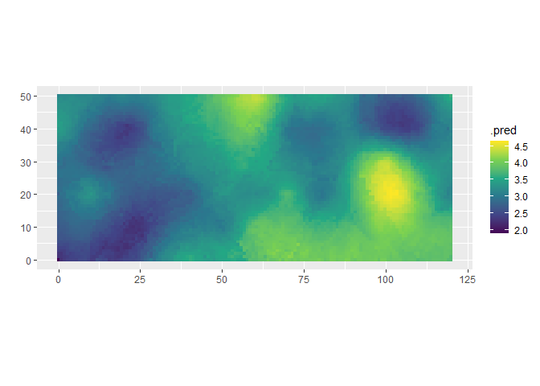<!-- --><!-- --><!-- --><!-- --><!-- -->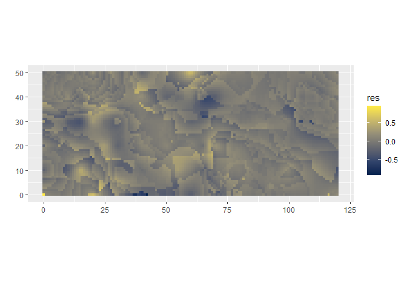<!-- -->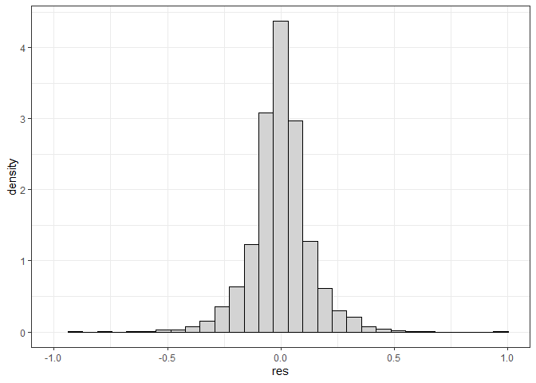<!-- --><!-- --><!-- --><!-- --><!-- --><!-- --><!-- --><!-- --><!-- --><!-- -->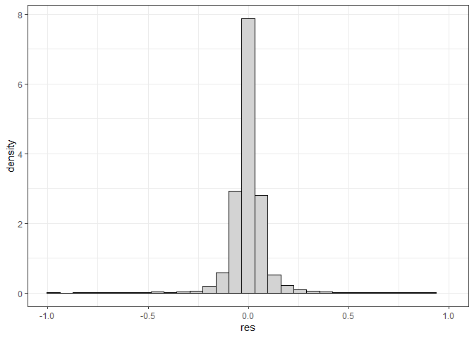<!-- --><!-- --><!-- -->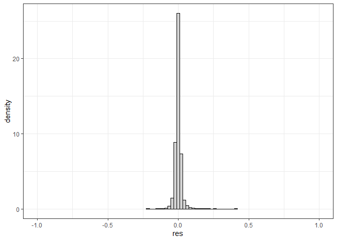<!-- --><!-- -->

## Mapas Silvipastoril

``` r
for(i in seq(files_sp)){
  mp<-read.table(files_sp[i],skip = 5)
  image(mp %>%  as.matrix(),xlab = files_sp[i])
}
```

<!-- --><!-- --><!-- --><!-- --><!-- --><!-- --><!-- --><!-- --><!-- --><!-- --><!-- --><!-- --><!-- --><!-- --><!-- --><!-- --><!-- --><!-- --><!-- --><!-- --><!-- --><!-- --><!-- --><!-- --><!-- --><!-- --><!-- --><!-- --><!-- --><!-- --><!-- --><!-- --><!-- --><!-- --><!-- --><!-- --><!-- --><!-- --><!-- --><!-- -->
